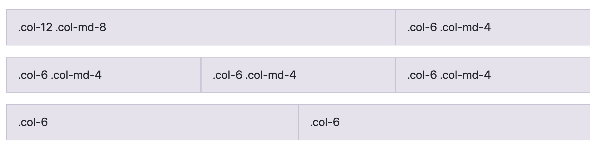

<!--
Created by: Ilias Tsangaris
Adapted by: Zeb Girouard & Nick Anderson
Market: DEN
-->


# Bootstrap

<!--Hook: https://twitter.com/
	http://www.angelfire.com/extreme/xtremesportz/index.html
	Which of these do you like more?
	With Twitter Bootstrap, we can "stand on the shoulders of giants", and not have to worry about crafting our basic HTML page into a modern, eye-pleasing page all by ourselves.
-->	

## Why is this important? (5 min)
<!-- framing the "why" in big-picture/real world examples -->
*This workshop is important because:*

Bootstrap is a **library of CSS classes** that helps make any old site look nice with very little effort. It comes with a **grid system** that makes layout out content on a variety of screen sizes much easier to deal with.

## What are the objectives?
<!-- specific/measurable goal for students to achieve -->
*After this workshop, developers will be able to:*

* **Implement** class-based CSS
* **Require** Bootstrap into your project
* **Use** and **build** a grid system
* **Design** HTML pages with the aid of Bootstrap & mockups

## Where should we be now?
<!-- call out the skills that are prerequisites -->
*Before this workshop, developers should already be able to:*

- **Write** custom HTML & CSS
- **Include** external stylesheets

<!-- CFU: Fist-to-five how do we feel about these? -->

## Intro to Bootstrap (5 min)

* [Bootstrap](http://getbootstrap.com/) is a **front-end framework** created by a small team of developers at Twitter and maintained by a much larger community of contributors.
* The framework consists of one main CSS file, an optional theme CSS file, and a main JS file.
* Parts of Bootstrap require [jQuery](https://code.jquery.com/) to work.
* And it has excellent documentation!

Bootstrap is extremely popular and knowledge of at least one CSS framework is a very valuable skill to have.

Bootstrap comes with a ton of features, including:

- Responsive Grid System
- CSS library for quick and easy styling
- UI components - HTML + CSS 
  - buttons
  - forms
  - etc.
 
*Optional*

- Javascript widgets to make your page interactive (e.g. a nav bar)
- Icons
- & more!

## Notable Sites Using Bootstrap

* [NBA.com](http://www.nba.com/)
* [Bloomberg](http://www.bloomberg.com/)
* [CodeAcademy](https://www.codecademy.com/)

## What is Class-based CSS? (5 min)

When we create modular classes in CSS, we make style rules that *encapsulate* a certain behavior and name them semantically - that is, very clearly and simply. This way, they can be reused multiple times on different elements.

For instance:

* `.rounded-circle` — will crop an element into a circle
* `.align-middle` — will vertically align an element to the middle of it's container
* `.close` — will fill the element with a close icon


## Including Bootstrap with HTML (5 min)

* To use Bootstrap, we need to include Bootstrap's CSS and Javascript libraries.
* We also need to include jQuery, as Bootstrap's JS plug-ins depend on it.

There are a few different ways to accomplish this:

1. CDN (Content Delivery Network) - someone else hosts the library/framework and you access it via a [URL](https://getbootstrap.com/docs/4.0/getting-started/download/).
2. [Download](https://getbootstrap.com/docs/4.0/getting-started/download/) the actual CSS and JS files and link to them on your local computer - better for offline/local development.

In this class, we'll keep it simple and stick with the CDN. As a result, our HTML page should look something like this:


```html
<!DOCTYPE html>
<html>
<head>
  <title>Will Bootstrap 4 $</title>
  <meta charset="utf-8" />
  <meta http-equiv="Content-type" content="text/html; charset=utf-8" />
  <meta name="viewport" content="width=device-width, initial-scale=1" />
  <!-- Bootstrap CSS CDN -->
  <link rel="stylesheet" href="https://maxcdn.bootstrapcdn.com/bootstrap/4.0.0/css/bootstrap.min.css" integrity="sha384-Gn5384xqQ1aoWXA+058RXPxPg6fy4IWvTNh0E263XmFcJlSAwiGgFAW/dAiS6JXm" crossorigin="anonymous">
</head>
<body>

	<!--jQuery CDN-->
  <script src="https://code.jquery.com/jquery-3.2.1.slim.min.js" integrity="sha384-KJ3o2DKtIkvYIK3UENzmM7KCkRr/rE9/Qpg6aAZGJwFDMVNA/GpGFF93hXpG5KkN" crossorigin="anonymous"></script>
  <!--Popper CDN-->
  <script src="https://cdnjs.cloudflare.com/ajax/libs/popper.js/1.12.9/umd/popper.min.js" integrity="sha384-ApNbgh9B+Y1QKtv3Rn7W3mgPxhU9K/ScQsAP7hUibX39j7fakFPskvXusvfa0b4Q" crossorigin="anonymous"></script>
  <!--Bootstrap JS CDN-->
  <script src="https://maxcdn.bootstrapcdn.com/bootstrap/4.0.0/js/bootstrap.min.js" integrity="sha384-JZR6Spejh4U02d8jOt6vLEHfe/JQGiRRSQQxSfFWpi1MquVdAyjUar5+76PVCmYl" crossorigin="anonymous"></script>
</body>
</html>
```


## What is Responsive Design? (5 min)

Responsive web diesgn (RWD) is both a philosophy and a practice:

1. RWD is the *philosophy* that websites should adapt to whatever size screen their on - from mobile all the way up to large desktop screens - and display optimally on them, without having to pinch/zoom/scroll unnecessarily. 

2. RWD is the *practice* of building web sites that scale to their environment, using Media Queries, CSS Frameworks like Boostrap, and other techniques.

## Responsive Meta Tag

There's one important first step to a responsive website - and that's the Responsive Meta Tag. Be sure to place this in the head of your HTML document:

`<meta name="viewport" content="width=device-width, initial-scale=1">`

Many browsers still assume websites are not designed to be responsive, and will try to "guess" what you want the page to look like - this will involve lots of incorrect zooming and text-sizing. This meta tag tells your browser to cut it out and trust you.


## Bootstrap and the Responsive Grid System (15 min)

Arguably, Bootstrap's greatest contribtion to RWD is it's Responsive Grid System. It allows your entire page (or any HTML element, for that matter) to operate as a 12-column grid. This is also a common design standard, making your work with designers all the easier.



> The grid system is simple in concept, but has a lot of depth to it - luckily Boostrap has [great documentation](https://getbootstrap.com/docs/4.0/layout/grid/) on it, if you feel the need to investigate.

For a page-level grid - the most common implementation - you'll need 3 HTML elements, with 3 corresponding Bootstrap classes:


#### .container (or .container-fluid)
**Containers** provide a means to center and horizontally pad your site’s contents. Use .container for a responsive pixel width or .container-fluid for width: 100% across all viewport and device sizes.

#### .row
**Rows are wrappers** for columns. Each column has horizontal padding (called a gutter) for controlling the space between them. 

#### .col-x (columns, with 'x' being a variable)
**Columns** represent a single horizontal block inside of a row. In our grid layout, content must be placed within columns and only columns may be immediate children of rows.

Columns can be sized in three different ways:

- **.col (no size specified)** 
If you don't specify any width, your columns will take up an even amount of space filling your role. For example, four instances of **.col** will make each column take up 25% of it's container.
- **.col-sm (breakpoint specified)**
Same as above, only the column will only apply to the specified screen size and larger. For instance, using .col-lg will only create a column on larger screens. 
- **.col-sm-6 (size and breakpoint specified)** 
You can specify that a column should take up an exact number of columns, up to 12. For instance, .col-sm-6 will take up 50% of it's container, and all other columns without specified size will flow around them in the remaining space. 

### Column sizing

12 is a magic number - it's divisible by 2, 3, 4, and 6 (meaning we can have columns that are: half-width, third-width, quarter-width, and sixth-width - aka 50%, ~33.3%, 25%, and ~16.7%):

    6 + 6                                           = 12
    4 + 4 + 4                                       = 12
    3 + 3 + 3 + 3                                   = 12
    2 + 2 + 2 + 2 + 2 + 2                           = 12
    1 + 1 + 1 + 1 + 1 + 1 + 1 + 1 + 1 + 1 + 1 + 1   = 12

So for a  typical two column layout (main content area + sidebar):

  ```html
   <div class="row">
     <div class="col-md-8">
       I'm a big column
      </div>
     <div class="col-md-4">
       I'm just a sidebar
     </div>
   </div>
  ```
  Because:
  
  8 + 4                                           = 12

### Screen Sizing

Next, we'll select what screen size we'll want it to display on: 

  - `col` < 576px (Extra Small, e.g. small smartphones)
  - `col-sm` ≥ 576px (Small, e.g. average smartphones)
  - `col-md` ≥ 768px (Medium, e.g. tablets in Portrait)
  - `col-lg` ≥ 992px (Large, e.g. tablets in landscape and some small laptops)
  - `col-xl` ≥ 1200px (Extra Large, e.g. laptops/desktops)

For a no-fuss implementation, you can set your entire grid up with `col-sm` and Bootstrap will be able to guess the rest - for both larger and smaller screens. However, you might want to make more specific declarations based on screensize - for this, you can use as many screen size declarations as you like:

```html
   <div class="col-sm-12 col-md-6 col-lg-4">Totally fine!</div>
```
The above example will occupy a different number of columns depending on the screensize:

  - < 576px = 12 columns
  - ≥ 576px = 12 columns
  - ≥ 768px = 6 columns
  - ≥ 992px = 4 columns
  
### Nesting

You can next columns inside of columns. For instance:

```html
  <div class="row">
        <div class="col-sm">
          <div class="row">
            <div class="col-sm">
              Nested!
            </div>
            <div class="col-sm">
              So intricately!
            </div>
          </div>
        </div>
        <div class="col-sm">column 2</div>
        <div class="col-sm">column 3</div>
    </div>
```

## Additional Grid Alignment

### Vertical Alignment

Bootstrap v4 uses `flexbox`, a CSS layout tool that makes it easier than ever to lay out web pages. Adding `.align-items-center` to any row vertically aligns content to the middle:

```html
 <div class="row align-items-center">
    <div class="col">
      One of three columns
    </div>
    <div class="col">
      One of three columns
    </div>
    <div class="col">
      One of three columns
    </div>
  </div>
```

### Reordering

You can also reorder elements with `flexbox`. Use `.order-` classes for controlling the visual order of your content. These classes are responsive, so you can set the order by breakpoint (e.g., `.order-1.order-md-2`):

```html
  <div class="row">
    <div class="col">
      First, but unordered
    </div>
    <div class="col order-12">
      Second, but last
    </div>
    <div class="col order-1">
      Third, but first
    </div>
  </div>
```

### More Grid Tools

There's lots of other great grid utilities listed on [Bootstrap's Documentation](https://getbootstrap.com/docs/4.0/layout/grid/), including Column Offset, SASS Variables, Gutterless Columns, and more.

## 

The grid system is just the tip of the iceberg! Bootstrap also offers a wide variety of Utility Classes that can be applied to elements. Once again, I recommend going through the documentation to discover the full range of tools available:
[http://getbootstrap.com/docs/4.0/getting-started/introduction/](http://getbootstrap.com/docs/4.0/getting-started/introduction/)

## Bootstrap Grid Sandbox (10 min)

Fork this repo and look at the `sample-project` directory - inside is a sample HTML page with a proper grid system set up. Squish the screen and see how the grid breaks to work on smaller screens! Let's take some time to play with the values!

## More Bootstrap Tools

The grid system is just the tip of the iceberg! Bootstrap has dozens of built in tools that can be used to style your content.

### Basic Style resets

As soon as you link to Bootstrap, you'll see several small changes - your default typeface will change to the default, OS-recommended typeface for your operating system, and well-proportioned margins and padding will appear on all default elements. This is because Bootstrap uses Reboot, a variation of [Normalize](https://necolas.github.io/normalize.css/), to provide common layout fixes.

### Images 
Bootstrap has a lot of classes that [help style images](https://getbootstrap.com/docs/4.0/content/images/) based on common practices. For instance:

- **.img-fluid** - Forces an image to go full width across the page, and shrink appropriately on smaller screens.
- **.rounded** - Crops your image into a circle, like Instagram or Twitter
- **.float-left or .float-right** - Pushes your image to the left or right of the content in its container

### Components
Lots of common UI features are already baked into Bootstrap. For instance, try adding in: 

- [A Basic Nav](https://getbootstrap.com/docs/4.0/components/navs/)
- [A Lightbox Modal](https://getbootstrap.com/docs/4.0/components/modal/)
- [An Image Carousel](https://getbootstrap.com/docs/4.0/components/carousel/)


### Forms and Tables
Never be basic again! Simply adding classes like `.table` or `.form-group` can completely overhaul the style of your commonly used components. Check out the [forms](https://getbootstrap.com/docs/4.0/components/forms/) and [table](https://getbootstrap.com/docs/4.0/content/tables/) documentation for more info. 

### Icons
Bootstrap doesn’t include an icon library by default, but we have a handful of [recommendations for you to choose from](https://getbootstrap.com/docs/4.0/extend/icons/).

## Challenge: Choose your own adventure (10 min)

Pick some aspect of Bootstrap that interests you, and investigate! Spend this block of time learning how it works and trying to get it to work. Be prepared to share it with the rest of the class!

## Other Frameworks to check out

- [Foundation](http://foundation.zurb.com/) - another CSS-library, similar to Bootstrap
- [Skeleton](http://getskeleton.com/) - a lovely, minimal, unopinionated CSS library
- [Materialize](http://materializecss.com/) - front-end framework based on "material design"

## Licensing
All content is licensed under a CC­BY­NC­SA 4.0 license.
All software code is licensed under GNU GPLv3. For commercial use or alternative licensing, please contact legal@ga.co.
